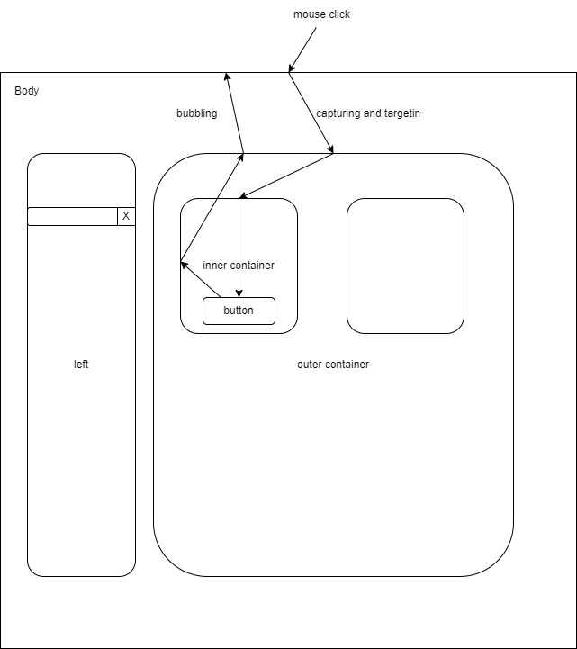

# DOM
- Document Object Model 
  - Object oriented related
  - Only one DOM in the HTML page
  - If there is an iframe tag then it has its own DOM
  - Communication between iframe DOM and main DOM is possible but they are independent.
  - window.document === document is true
  - ele.addEventListener 

# NOTES
## addEventListener
- 3 arguments
  - Event name (e.g. 'click', 'mouseover', 'keyup', 'keydown')
  - listener function (pending)
  - option (pending)
​- When listener function gets called it calls with event object
  - Event object contains several properties in which
    - `currentTarget` is the property, on which we have assigned the event
    - `target` is the property, on which event detected

## Event phases

There are three phases
- `capturing` or `capture`
- `targeting`
- `bubbling`

## problem statement (TASK create example)
  - There is a following heirarchy 
    - header -> nav -> button -> svg
  - Event is assigned on header tag
  - When user clicks on button
  - Then target is svg and currentTarget is header
  - What went wrong: svg should not be clickable as it is consider as button.
### Solution
- `solution 1`: check svg parentElement if it is button then execute your code otherwise don't
- `solution 2`: all the element inside the button should be made non-interactive via CSS property `pointer-events: none;`

## TODO
- [x] Add event listener
- [ ] Event listner remove
- [-] Type of events
- [ ] Stop bubbling
- [ ] Capture phase
- [ ] 3 argument of addEventListener